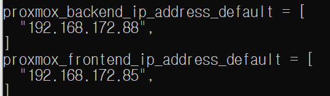
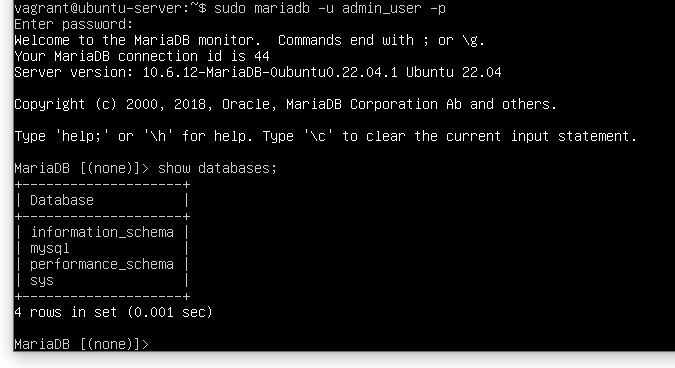

# Instruction

IT For Hire's base skeleton was developed with basic HTML and CSS for the user interface, alongside some features of Javascript and Node JS for functionality and implementation and will utilize Maria DB are the back-end database. To successfully deploy at the current state the program is in, all there is to do is download the raw HTML code folders and run the HTML pages from your local folder. At this current phase, IT For Hire is not being powered by our server yet, however our server (both front-end and back-end) has been developed and created. Once actually powered by a web server, the deployment of IT For Hire will be much simpler, as it will be located online and via URL.  

-- info for deploying server
1. Ensure that vagrant has been installed beforehand.
2. Retreive templates from team repo (git clone)
3. Open command prompt.
4. Generate another keypair by typing
ssh-keygen
5. Save this new keypair and generate and a config file
6. Make sure to add your Public Key to the team-repo for authentication
7. Test connection via 
ssh git@github.com
If all works proceed
8. Start vagrant by typing
vagrant up
9. Type the following command. (replace private_key_name with your key)
ssh -i $private_key_name vagrant@system85.rice.iit.edu
10. Enter the server username and password as vagrant:vagrant

11. Congratulations, the server has been deployed successfully. 

-- info for deploying DB
1. Once servers are deployed, type the following command in command prompt:
sudo mariadb -u admin_user -p
2. Enter "password"
Your end result should look like this.

3. Congratulations, mariaDB is now running successfully.

-- info for deploying VM - vagrant/packer
=======
* info for deploying server
1. Open command prompt.
2. Type the following command.
ssh -i $private_key_name vagrant@system85.rice.iit.edu
3. Enter the server username and password as vagrant:vagrant  

* info for deploying DB
1. Once servers are deployed, type the following command in command promt:
sudo mariadb -u admin_user -p  
2. Enter "password"
Your end result should look like this.  

* info for deploying VM - vagrant/packer
1. Open command prompt.
2. Start vagrant by typing
vagrant up
3. Type the following command. (Replace private_key_name with yours)
ssh -i $private_key_name vagrant@system88.rice.iit.edu
4. Enter the server username and password as vagrant:vagrant

=======
3. Enter the server username and password as vagrant:vagrant   

* any scripts?
