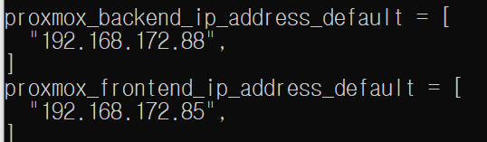
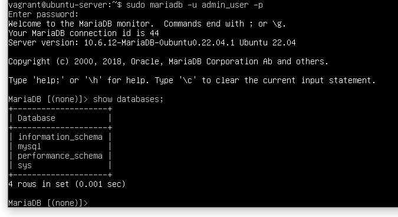

# Instruction

IT For Hire's base skeleton was developed with basic HTML and CSS for the user interface, alongside some features of Javascript and Node JS for functionality and implementation and will utilize Maria DB are the back-end database. To successfully deploy at the current state the program is in, all there is to do is download the raw HTML code folders and run the HTML pages from your local folder. At this current phase, IT For Hire is not being powered by our server yet, however our server (both front-end and back-end) has been developed and created. Once actually powered by a web server, the deployment of IT For Hire will be much simpler, as it will be located online and via URL.  

## Sprint 2

-- info for deploying server
1. Ensure that vagrant has been installed beforehand.
2. Retreive templates from team repo (git clone)
3. Open command prompt.
4. Generate another keypair by typing
ssh-keygen
5. Save this new keypair and generate and a config file
6. Make sure to add your Public Key to the team-repo for authentication
7. Test connection via 
ssh git@github.com
If all works proceed
8. Start vagrant by typing
vagrant up
9. Type the following command. (replace private_key_name with your key)
ssh -i $private_key_name vagrant@system85.rice.iit.edu
10. Enter the server username and password as vagrant:vagrant

11. Congratulations, the server has been deployed successfully. 

-- info for deploying DB
1. Once servers are deployed, type the following command in command prompt:
sudo mariadb -u admin_user -p
2. Enter "password"
Your end result should look like this.

3. Congratulations, mariaDB is now running successfully.

-- info for deploying VM - vagrant/packer
=======
* info for deploying server
1. Open command prompt.
2. Type the following command.
ssh -i $private_key_name vagrant@system85.rice.iit.edu
3. Enter the server username and password as vagrant:vagrant  

* info for deploying DB
1. Once servers are deployed, type the following command in command promt:
sudo mariadb -u admin_user -p  
2. Enter "password"
Your end result should look like this.  

* info for deploying VM - vagrant/packer
1. Open command prompt.
2. Start vagrant by typing
vagrant up
3. Type the following command. (Replace private_key_name with yours)
ssh -i $private_key_name vagrant@system88.rice.iit.edu
4. Enter the server username and password as vagrant:vagrant
 

## Sprint 3
- Info for executing Packer Build Templates + Terraform Plan 

Although not accomplished for this sprint, once the server is up and running, our site will be reachable via a webpage URL and will run on any machine, etc. With the server up and running, the database will be connected as well - to begin to collect data of users that log in to our page and begin to interact with its features such as job postings, job browsing, etc. Google Authetication is using Google's pre-built API's and platform library which are both imported externally. To execute our website in its current state (3/19/23), user can either run HTML pages locally and power them on a localhost server, or also run the EJS files from a localhost, ports used and recognized by the google api is 8000.

Using the build server:
Ensure the following conditions are met:
	- You have your remote key (refer to assignment Remote Build Server Public Key)
	- Your remote key is added to your github account
	- You are either on IIT's network or connected to vpn.iit.edu
	
1. Open command prompt.
2. SSH into the build server using the following command
ssh -i (your public remote key) (your hawk username)@system44.rice.iit.edu
3. Clone the team repo using the SSH link 
git clone git@github.com:illinoistech-itm/team-03m-2023.git
4. You're ready to deploy and pass secrets in the build server.

Running Packer:

Ensure that the team repo has been cloned to the build server.

1. cd into our  team-03m-2023 repo, then sprint-03, then build
2. cd into the proxmox-template repo, then packer
3. change names of files that have template/ template-for by removing said names
4. Generate a new key using ssh-keygen ed25519, save the public key to your github account
5. Add this private key to the config file and variables files
6. In the variables.pkr.hcl file, add your credentials sent to you by the professor
7. Run packer init .
8. Run packer validate .
9. Run packer build .

Running Terraform:
1. cd into our  team-03m-2023 repo, then sprint-03, then build
2. cd into the proxmox-template repo, then terraform
3. change names of files that have template/ template-for by removing said names
4. Generate a new key using ssh-keygen ed25519, save the public key to your github account
5. Add this private key to the config file and variables files
6. Use terraform apply to deploy